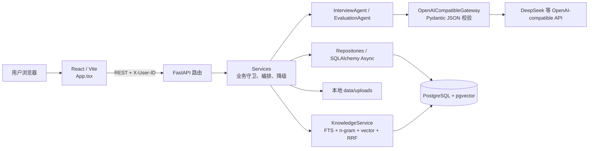

# Interview Copilot Agent：项目理解文档

> 本文依据当前仓库源码、迁移、测试与 README 编写，记录时间：2026-08-12。设计稿中出现、但当前代码没有实现的能力会明确标记为“未实现”或“代码中未体现，需要确认”。

## 1. 项目最终目标

一句话：为 AI 应用开发等技术岗位求职者提供“简历与岗位分析 → 个性化文字模拟面试 → 可解释评分与长期训练”的本地优先 Agent 系统。

核心能力：

1. 上传 PDF、DOCX、Markdown、TXT 简历并提取正文，使用受控大模型结构化生成候选人画像；岗位可选预置模板或输入自定义 JD。
2. 依据结构化简历和 JD，以确定性 70/20/10 规则生成可解释的能力匹配与复习优先级。
3. 由 `InterviewAgent` 生成面试计划、决定追问/下一题/结束；由持久化会话状态保存进度，支持暂停、恢复与刷新后继续。
4. 由 `EvaluationAgent` 输出单题反馈；后端按照固定 Rubric 重算总分，并在模型不可用时走本地降级逻辑。
5. 建立带 PostgreSQL FTS、中文字符 n-gram、可选 pgvector 语义检索和用户反馈调权的项目知识库，为出题与评价提供带来源的上下文。

## 2. 当前进度与完成度

### 已实现

| 能力 | 关键实现位置 | 说明 |
|---|---|---|
| 本地用户与数据隔离 | `backend/app/api/deps.py`、各 Repository | 业务接口通过 `X-User-ID` 获取 UUID，并在用户资料、简历、JD、面试、知识库查询中使用 `user_id` 过滤。 |
| 简历文件上传与解析 | `services/documents.py` 的 `ResumeService.create_from_file`；`services/knowledge.py` 的 `extract_text` | 支持 PDF（PyMuPDF）、DOCX（python-docx）、MD/TXT；原文件写入本地 `data/uploads`，正文写入 PostgreSQL。 |
| 简历结构化分析与本地降级 | `services/analysis.py` 的 `ResumeAnalysisService.analyze` | 调用结构化模型提取候选人画像；项目证据必须能在简历正文中回查。模型或校验失败时使用关键词基础解析并保存结果。 |
| JD 结构化分析 | `JobAnalysisService.analyze`、`prompts/job_extract/v1.md` | 将岗位文本提取成职责、必备/加分技能、面试重点等结构化数据。 |
| 岗位匹配 | `services/matches.py` | 依据标准化技能名、项目来源证据计算准备指数，并返回逐技能判定、证据不足与建议顺序。 |
| 面试计划 | `services/interviews.py` 的 `InterviewPlanService` | 调用 `InterviewAgent.create_plan` 保存计划；模型异常时构造预设技术/项目/行为题蓝图。 |
| 持久化面试会话 | `InterviewSessionService`、`models/interviews.py` | 创建、开始、暂停、恢复、当前题读取、回答保存；会话、题目和回答均持久化。 |
| 回答幂等与并发保护 | `InterviewSessionService.submit_answer`；前端 `InterviewPanel.submit` | 前端将当前题的 UUID 保存在 `localStorage`；后端以 `(question_id, idempotency_key)` 唯一约束和嵌套事务处理重复/竞争提交。 |
| 单题评价 | `EvaluationWorkflowService.evaluate_current_answer` | 保存确定性检查、模型评价、Rubric、生成配置与置信度；总分由 `AnswerEvaluation.recompute_score` 重算。 |
| 面试推进与降级 | `EvaluationWorkflowService._advance_after_evaluation` | 评价后调用 Interview Agent 决定追问、下一题或结束；模型异常时按未问过的计划蓝图继续，全部用尽后完成。 |
| 整场报告与复习计划 | `services/progress.py` 的 `ReportService`、`ProgressService` | 聚合单题成绩、强弱技能和建议；首次生成报告更新 `SkillMastery` 的掌握度、连续对错次数与下次复习时间。 |
| 历史趋势 | `GET /api/v1/progress/history`、前端 `ProgressPanel` | 按完成时间展示报告历史、最近两场分差与近三场平均分。 |
| 知识库与混合检索 | `services/knowledge.py`、`repositories/knowledge.py` | 文档切分、FTS、字符 n-gram 回退、可选向量检索、RRF 和轻量重排；搜索事件和引用反馈都会持久化。 |
| RAG 引用反馈 | `KnowledgeService.record_feedback`、`feedback_signals_for_chunks` | “有帮助/不相关”以受限分值影响当前用户后续的排序，不直接覆盖原始相似度。 |
| 决策审计 | `models/agent_audits.py`、`AgentDecisionRepository` | 计划、评价、面试推进写入 Agent 名称、动作、模型/降级模式、输入摘要、输出摘要、模型与 Prompt 版本。 |
| 数据库演进与验证 | `backend/alembic/versions/`、`backend/tests/` | 12 个迁移版本；当前测试覆盖状态机、评分、匹配、RAG、文件解析、幂等、降级、复习与历史趋势。 |
| Web UI 与一键启动 | `frontend/src/App.tsx`、`start.cmd`、`scripts/start-dev.ps1` | React 单页 UI；根目录双击 `start.cmd` 会启动 PostgreSQL、迁移、后端、前端并打开浏览器。 |

### 部分实现 / 有边界的实现

| 能力 | 当前边界 | 关键文件 |
|---|---|---|
| “Agent”自主性 | 只有 Interview Agent 与 Evaluation Agent 面向模型；所有数据读写、状态转移、ACL、评分汇总都由普通服务控制。 | `agents/`、`services/interviews.py` |
| 模型调用可靠性 | 有 JSON 提取、Pydantic 校验和最多 `llm_max_retries + 1` 次请求；但没有 provider 级熔断、限流、指标平台或请求队列。 | `services/model_gateway.py` |
| RAG 语义检索 | 配置 Embeddings 才启用；未配置时仍可用 FTS/字符 n-gram，但不能保证同义改写召回。 | `services/knowledge.py`、`.env.example` |
| 报告 | 是对已保存评价的确定性聚合，不是 LLM 生成的长篇报告；前端展示总分、强弱项和建议。 | `services/progress.py`、`App.tsx` |
| 进度趋势 | 有历史列表、分差和近三场均分；没有图表库、时间序列统计或按岗位/技能筛选。 | `api/v1/progress.py`、`ProgressPanel` |
| 本地部署 | Windows 一键开发启动与 Docker Compose 均有；尚未看到 CI/CD、生产反向代理 TLS、密钥管理或云部署配置。 | `start.cmd`、`scripts/`、`docker-compose.yml` |

### 未实现 / 代码中未体现，需要确认

- **真实认证与授权**：`X-User-ID` 是客户端可伪造的临时本地身份边界，不是登录、Token/JWT 或多租户认证。
- **SSE / WebSocket 实时推送**：`agent_design.md` 提到 SSE，但 API、前端和依赖中没有对应实现；当前采用 HTTP 请求后再查询会话状态。
- **后台队列、异步任务与任务进度**：文档解析、Embedding、模型调用和批量重建均在 API 请求内执行；没有 Celery、RQ、Kafka、Redis Queue 等代码。
- **LangChain / LlamaIndex**：当前依赖和导入中未使用；RAG 和 Agent 编排均是原生 FastAPI + SQLAlchemy + httpx 实现。
- **音视频面试、语音转写、摄像头、代码编辑器、在线判题、消息通知**：代码中未体现，需要确认。
- **用户手工编辑画像、JD、报告、知识库元数据的界面/API**：代码中未体现；目前主要是创建、分析、查询与删除知识库文件。
- **面试完成后自动生成报告**：当前必须调用 `POST /report/regenerate`（前端按钮“生成整场报告”）；不会在最后一题评价后自动生成。

## 3. 架构概览

### 核心模块与依赖

- 前端：React 19、TypeScript、Vite。`frontend/src/App.tsx` 是当前主要页面与流程编排文件，`api.ts` 统一附加 `X-User-ID` 与处理 API 错误。
- API：FastAPI + Pydantic。路由聚合在 `backend/app/api/router.py`，入口为 `backend/app/main.py`。
- 业务层：Services 负责领域逻辑，Repositories 负责 SQLAlchemy 查询和持久化，Pydantic Schemas 作为 API/模型输出契约。
- Agent / LLM：原生 `httpx` 调用 OpenAI-compatible `/chat/completions`；没有 LangChain/LlamaIndex。`StructuredModelGateway` 约束 LLM 只能返回符合 Schema 的 JSON。
- 数据：PostgreSQL 16 + pgvector；SQLAlchemy AsyncSession + asyncpg；Alembic 管理迁移。文件原件保存到本地 `data/uploads`。
- 检索：PostgreSQL FTS（`to_tsvector` / `websearch_to_tsquery`）、中文字符 n-gram、可选 pgvector cosine distance、RRF 和本地重排。
- 运行：Docker Compose 仅定义 `postgres`、`backend`、`frontend` 三个容器；本地开发脚本则启动 Docker PostgreSQL + Uvicorn（18000）+ Vite（5173）。



### 一次完整执行流程：从“上传简历”到“生成整场报告”

下面是当前前端默认路径，也是数据如何流动的完整说明。

1. **创建本地用户**
   - 前端 `frontend/src/App.tsx` 的 `createUser` 调用 `POST /api/v1/users`。
   - `backend/app/api/v1/users.py` 创建 `User`；前端把返回 UUID 存到浏览器 `localStorage` 的 `interview-copilot-user`。
   - 之后 `frontend/src/api.ts` 的 `api()` 为每个业务请求加上 `X-User-ID`。后端 `api/deps.py::current_user_id` 只解析这个 UUID；它并不验证登录身份。

2. **上传并分析简历**
   - `Materials` 面板将文件以 `FormData` 发送到 `POST /api/v1/resumes/upload`，再调用 `POST /api/v1/resumes/{id}/analyze`。
   - `api/v1/resumes.py::upload_resume` → `ResumeService.create_from_file`：检查扩展名、20MB 上限，复用 `knowledge.extract_text()` 解析 PDF/DOCX/MD/TXT，把原文件保存至 `data/uploads/resumes/<user_id>/`，并把正文与文件元数据存入 `resumes`。
   - `ResumeAnalysisService.analyze` 将 `raw_text` 放入 `ResumeAnalysisInput`，经 `OpenAICompatibleGateway.complete_structured()` 调用 `prompts/resume_extract/v1.md`。
   - Gateway 读取 Prompt 和 Pydantic JSON Schema，调用 `CHAT_BASE_URL/chat/completions`，从模型文本中提取 JSON，使用 `ResumeExtractionOutput` 校验。`_bind_and_validate_evidence` 会把模型给出的项目证据逐条在 `resume.raw_text` 中查证；验证成功后将 `parsed_profile_json` 和 `evidence_map_json` 回写数据库。
   - 若这一步抛出任何异常，简历分析改用 `_fallback_profile` 的关键词扫描（例如 Python、FastAPI、RAG），并返回提示。也就是说，简历流程不会因模型不可用而中断，但画像质量会较低。

3. **选择并分析岗位**
   - 前端 `jobTemplates` 提供三个模板，也允许输入自定义岗位文本。`Materials.chooseJob` 调用 `POST /api/v1/jobs`，随后调用 `POST /api/v1/jobs/{id}/analyze`。
   - `JobAnalysisService.analyze` 使用 `prompts/job_extract/v1.md` 和 `JobAnalysisOutput`，把解析结果存到 `job_descriptions.parsed_requirements_json`。
   - 与简历不同，岗位分析服务当前没有显式本地 fallback；模型异常将由统一错误处理返回错误。

4. **可解释岗位匹配（可选但前端支持）**
   - `MatchPanel.run` 调用 `POST /api/v1/matches`。
   - `MatchService.create_report` 读取已存 JSON，转回 `CandidateProfile` 和 `JobProfile`；`_build_report` 通过 `normalize_skill()` 标准化技能别名，再调用 `_evidence_refs_for_skill()` 判断是否有项目证据。
   - 最终写入 `match_analyses.report_json`：

     ```text
     readiness_index = 0.70 × 必备技能覆盖率
                     + 0.20 × 加分技能覆盖率
                     + 0.10 × 项目证据覆盖率
     ```

5. **生成面试计划**
   - `InterviewPanel.createPlan` 调用 `POST /api/v1/interview-plans`，传递简历和岗位 ID；未完成两者结构化分析时，`InterviewPlanService.create` 返回 409。
   - 服务读取候选人/岗位 Profile，构造 `InterviewPlanningInput`，再调用 `InterviewAgent.create_plan()` → Prompt `interview_plan/v1.md` → `InterviewPlanDraft`。
   - 成功时将模型计划以 JSON 存进 `interview_plans.plan_json`；失败时 `_fallback_plan()` 生成技术题、系统设计题、可选项目题和行为题。无论哪种路径，都会新增 `agent_decision_logs` 记录模式为 `model` 或 `fallback`。

6. **开始面试与首题 RAG grounding**
   - 前端先 `POST /api/v1/interviews` 创建 `InterviewSession`（状态 `CREATED`），再调用 `/start`。
   - `InterviewSessionService.start` 读取计划第一道蓝图，调用 `_ground_question()`。它通过 `_retrieve_project_context()` 以“题干 + 技能标签”检索 `project_docs` / `knowledge_base`，把检索到的 `SourceRef` 合并到题目中。
   - 首题写入 `interview_questions`（题干、类型、难度、技能、期望要点、来源、指纹和 `order_index=0`），会话变为 `WAITING_ANSWER`。`GET /question` 将此题和来源返回给前端。

7. **提交回答：先持久化，再评价**
   - 前端 `InterviewPanel.submit` 为“会话 ID + 题目 ID”生成/复用 UUID 幂等键；先 `POST /answers`，再 `POST /evaluate`。
   - `InterviewSessionService.submit_answer` 检查会话应处于 `WAITING_ANSWER`；先按 `(question_id, idempotency_key)` 查重，再在 `session.begin_nested()` 内新增 `InterviewAnswer`，把会话改为 `ANSWER_SAVED`。
   - 数据库唯一约束 `uq_answer_idempotency` 是最终并发保护。若竞态导致 `IntegrityError`，服务会重新读取同一个幂等键对应的回答并返回，而不是再插入一条。

8. **单题评价、评分重算与面试推进**
   - `EvaluationWorkflowService.evaluate_current_answer` 只接受 `ANSWER_SAVED`，读取当前题、回答、计划、简历和 JD。
   - `_deterministic_checks()` 先得到非空、长度（至少 40 字）、期望要点精确文本命中、命中率和项目来源可用性；评价前还将“题目 + 技能 + 用户回答”再次检索项目资料，并与题目既有来源合并。
   - `EvaluationAgent.run()` 调用 `evaluation_agent/v1.md`；若失败，`_fallback_evaluation()` 按回答长度和期望要点命中生成低置信度本地评价。
   - 不信任模型返回的总分：`AnswerEvaluation.recompute_score(EvaluationRubric())` 使用正确性 25%、完整性 20%、相关性 15%、深度 15%、清晰度 10%、项目结合 10%、可信度 5% 重算。项目结合度为 `None` 时，对其余权重归一化。
   - 评价结果写入 `answer_evaluations`，包括 Rubric、`execution_mode`、确定性检查、置信度和 Prompt 版本；同时新增 Evaluation Agent 审计日志。
   - `_advance_after_evaluation()` 使用当前成绩、缺失点、会话和检索上下文调用 Interview Agent。若动作为 `follow_up` 且未到 `max_follow_ups`，保存追问；若 `next` 或追问上限已满，保存未问过的计划蓝图；若 `finish` 或蓝图耗尽，标为 `COMPLETED` 并写入 `completed_at`。模型不可用时直接走计划蓝图推进。

9. **生成报告、更新掌握度和展示历史**
   - 前端点击“生成整场报告”调用 `POST /api/v1/interviews/{id}/report/regenerate`。
   - `ReportService.generate` 仅允许 `COMPLETED` 会话，使用 `ReportRepository.evaluated_items()` 读取“题目 + 回答 + 单题评价”。`_summarize()` 计算总体分、维度均分、强弱技能、低置信度数量和建议，保存至 `interview_reports`。
   - 仅首次生成报告时调用 `ProgressService.apply_skill_scores()`：维护 `SkillMastery`，依掌握度/连续答对/连续答错计算下次复习时间，避免重复点击“重新生成”重复累计次数。
   - `GET /api/v1/progress/overview` 返回完成场次、评价数、薄弱主题和复习计划；`/history` 用报告与会话的连接结果计算历史列表、最近分差和近三场均分。前端 `ProgressPanel` 渲染这些数据。

## 4. 关键设计决策与取舍

| 决策 | 为什么这样选 | 没有选择 / 代价 |
|---|---|---|
| 只让两个 Agent 进行语义决策 | Interview Agent 负责“如何问”，Evaluation Agent 负责“如何评”；数据库、权限、状态机和得分由确定性服务控制，便于审计与降低幻觉影响。 | 未使用多 Agent 自主协作；可扩展性较弱，但边界更清晰。 |
| 原生 OpenAI-compatible Gateway + Pydantic | `httpx` 直接请求、Prompt 文件版本化、Schema 直接注入并校验，依赖少且易替换 DeepSeek 等服务。 | 不使用 LangChain/LlamaIndex；没有其链路追踪、工具生态和高层抽象。 |
| 模型 JSON 失败可降级 | 面试计划和评价都有确定性 fallback，保证模型、网络或结构化输出失败时仍能完成训练闭环。 | fallback 的题目与评价质量明显低于模型路径，且 `except Exception` 可能把非预期程序错误也伪装为降级。 |
| LLM 分项判断，后端重算总分 | 防止模型算术错误或直接操纵总体分；Rubric 版本与具体权重可追溯。 | “期望要点命中”是精确子串匹配，不能理解同义表达；当前确定性检查更多是审计信号，而非复杂事实核验。 |
| PostgreSQL + pgvector 一体化 | 业务数据、ACL、FTS、向量和检索事件共用一个数据库，运维和事务边界简单。 | 不使用专用向量库；大规模向量的索引策略、分片、性能压测代码未体现。 |
| FTS + 中文 n-gram + 可选向量 + RRF | 在没有 Embedding 配置时仍可处理关键词、删词、语序变化；有向量时提升语义匹配，再通过 Top 3、每文档最多 2 段和阈值减少冗余引用。 | PostgreSQL `simple` FTS 并不分词中文；真正的同义改写依赖外部 Embeddings。 |
| 引用反馈只做有限加权 | `feedback_signals_for_chunks()` 最多累计到 3 票强度，最终加/减分不超过 0.1，避免一次误点主导结果。 | 未训练学习排序模型，也没有反馈管理/撤销界面。 |
| 本地文件存储而非对象存储 | 对个人求职训练 MVP 来说部署简单，文件与数据库记录通过路径关联。 | 不适合多机、容器弹性扩容或可靠备份；路径安全和持久卷需要部署方自行保证。 |
| `X-User-ID` 作为临时身份 | 快速完成本地用户数据隔离并便于 Swagger/前端调试。 | 不是安全认证，不能直接用于公网部署。 |
| 前端 `localStorage` 恢复用户、ID、幂等键 | 刷新页面后能恢复计划和会话，降低用户丢失进度概率。 | 浏览器清缓存会丢当前引用；不同浏览器不共享；并非服务端会话认证。 |

## 5. 踩过的坑 & 已知问题

### 已处理或已有 workaround

1. **模型不返回合格 JSON / API 不可用**
   - 处理：`OpenAICompatibleGateway` 会抽取围栏/非围栏 JSON，使用 Pydantic 校验，并追加“修复为严格 JSON”的消息重试；计划和评价服务有 fallback。
   - 注意：简历有 fallback，JD 分析没有 fallback，配置错误仍会阻断 JD → 计划流程。

2. **重复点击提交、网络重试或并发请求**
   - 处理：前端本地保存幂等键，后端先查键、数据库唯一约束兜底、`IntegrityError` 后重新读取已有记录。
   - 现状：同题回答已保存后再使用不同幂等键会收到 409；这是防止同一题多答案的行为约束。

3. **中文检索调语序/删词无结果**
   - 处理：在 PostgreSQL FTS 之外实现 `_character_ngrams()` 和 `_keyword_score()` 回退；无 Embedding 也能覆盖部分中文短语变化。
   - 限制：语义等价但字符重叠很少的提问仍依赖 Embedding。

4. **检索命中过多且不相关**
   - 处理：约 900 字符、120 字符重叠的标题感知切分；RRF 后再结合词法/语义分数重排，低分阈值过滤，默认 Top 3，每文档最多 2 块。

5. **Windows 启动命令冗长 / PowerShell 执行策略**
   - 处理：根目录 `start.cmd` 和 `stop.cmd` 包装 PowerShell；可双击启动。底层 `scripts/start-dev.ps1` 会等待 PostgreSQL、执行 Alembic、后台启动 Uvicorn/Vite，并写 PID 和日志。

### 已知问题与技术债

| 问题 | 依据 | 影响 / 建议 |
|---|---|---|
| 状态机定义没有真正作为服务的统一执行器 | `workflows/interview_state_machine.py` 有 `ALLOWED_TRANSITIONS` 与 `InterviewStateMachine`，但 `services/interviews.py` 主要直接赋值 `interview.status`。 | 应统一让服务调用状态机，避免枚举定义和实际流程逐渐漂移。 |
| 状态枚举与实际使用不完全一致 | Enum 含 `QUESTION_READY`、`FOLLOW_UP_READY`、`NEXT_QUESTION_READY`、`REPORT_GENERATING`、`REPORT_READY` 等；当前服务主要使用 `CREATED`、`PREPARING`、`WAITING_ANSWER`、`ANSWER_SAVED`、`EVALUATING`、`PAUSED`、`COMPLETED`。 | 状态可观测性与设计稿不完全一致；建议删减未用状态或落地完整迁移。 |
| `duration_minutes` 未形成真实计时限制 | `_advance_after_evaluation()` 的 `remaining_minutes` 直接传 `config.duration_minutes`，没有根据 `started_at` 或题目耗时扣减。 | 当前时长只是计划配置/提示，不能强制到点结束。 |
| 报告非自动生成 | 前端与 API 都要求手动调用 `/report/regenerate`。 | 用户完成面试后还需点一次；可在最后一次评价成功后自动生成或入队。 |
| 前端健康状态写死 | `App.tsx` 总是显示“● 服务已连接”，未请求 `/health`。 | 后端不可用时会误导；建议真实轮询健康接口。 |
| 前端核心 UI 集中在单一大文件 | `frontend/src/App.tsx` 包含 Dashboard、资料、匹配、面试、知识库、进度六个面板，大量 JSX 写在单行。 | 可维护性、可测试性和 diff 可读性较低；建议按页面/组件拆分。 |
| 模型路径使用宽泛异常捕获 | 计划、简历和评价流程使用 `except Exception`。 | 保障可用性但会掩盖代码 bug；建议只捕获 `AppError`、`httpx`、Pydantic 等预期异常，同时记录错误栈。 |
| 文件在本地路径保存 | `ResumeService` 和 `KnowledgeService` 使用 `Path.write_bytes()`；Compose 只挂载 `./data/uploads:/app/data/uploads`。 | 不适合多实例和云存储，需要对象存储、病毒扫描、备份和下载权限设计。 |
| 嵌入维度被固定为 1024 | `Settings.embedding_dimensions` 的范围是 `ge=1024, le=1024`，`DocumentChunk` 的 `Vector` 也按该配置建列。 | 更换 768/1536 维模型要改配置约束、模型/迁移并重建索引。 |
| 同步长请求 | LLM、PDF 解析、Embedding 和全量重建均在 HTTP 请求内完成。 | 大文件/大量 chunks 可能超时；建议引入队列、进度状态和重试任务。 |
| 无真实认证、限流、审计检索 UI | 仅 `X-User-ID`；虽有 `agent_decision_logs`，但没有公开 API/前端审计查看界面。 | 不可直接公网使用；需认证、权限、限流、日志脱敏和审计 UI。 |
| 测试层级有限 | 有单元/服务/API 测试，README 没有浏览器 E2E、实际 DeepSeek/Embedding 契约测试、压测或 CI 工作流。 | 建议增加 Playwright、mock provider 契约测试、性能基线和 GitHub Actions。 |

## 6. 目录与文件职责说明

```text
Agent/
├─ frontend/                         # React + Vite 单页前端
├─ backend/                          # FastAPI、业务逻辑、迁移、测试
├─ scripts/                          # Windows 本地开发启停脚本
├─ docs/                             # 离线评测使用说明
├─ data/                             # 运行时 PostgreSQL 卷与上传文件（通常不提交）
├─ start.cmd / stop.cmd              # 双击式 Windows 启动入口
├─ docker-compose.yml                # postgres / backend / frontend 容器编排
├─ .env.example                      # 环境变量模板
├─ README.md                         # 面向使用者的运行与能力说明
├─ agent_design.md                   # 设计意图；部分内容尚未落实到代码
├─ spec.md / plan.md                 # 产品规格与计划文档
└─ PROJECT_UNDERSTANDING.md          # 本文
```

### 后端：`backend/app/`

| 目录/文件 | 职责 |
|---|---|
| `main.py` | 创建 FastAPI，安装异常处理，挂载总路由。 |
| `core/config.py` | `pydantic-settings` 读取 `.env`；定义数据库、Chat、Embedding、上传限制等配置。 |
| `core/errors.py` | `AppError` 及统一 `{ error: { code, message, request_id, retryable } }` JSON 错误响应。 |
| `db/session.py` | SQLAlchemy async engine、`AsyncSession` 依赖、成功提交/异常回滚事务边界。 |
| `api/router.py` | 聚合 users、resumes、jobs、matches、interviews、progress、knowledge、health 路由。 |
| `api/v1/*.py` | HTTP 参数/响应模型与依赖注入；不承担核心业务计算。 |
| `api/deps.py` | 当前仅从 `X-User-ID` 取得 UUID。 |
| `schemas/` | Pydantic 输入输出契约；`interview.py` 集中定义 Agent 输入、计划、题目、Rubric、评价和验证器。 |
| `models/` | SQLAlchemy 表模型；主要包括 documents、matches、interviews、evaluations、progress、knowledge、agent_audits。 |
| `repositories/` | 以当前用户过滤为前提的 SQL 查询/写入封装。`knowledge.py` 包含 FTS、向量距离和反馈查询。 |
| `services/documents.py` | 简历/JD 的创建、文件保存和文本解析协调。 |
| `services/analysis.py` | 简历/JD 受控模型分析、简历项目证据回查与简历 fallback。 |
| `services/matches.py` | 固定 70/20/10 匹配公式、技能别名、项目证据判断。 |
| `services/model_gateway.py` | OpenAI-compatible 结构化模型调用的唯一边界、JSON 提取、重试、Schema 校验。 |
| `agents/` | 轻量 Agent 抽象；只转发 Schema 输入给 Gateway，不操作数据库。 |
| `services/interviews.py` | 面试计划、会话、回答幂等、评价、RAG grounding、推进和 Agent 审计的核心编排。 |
| `workflows/interview_state_machine.py` | 状态及允许迁移的定义；当前没有被全部服务流程统一调用。 |
| `services/progress.py` | 整场报告聚合、技能掌握度、复习间隔、概览与历史趋势。 |
| `services/knowledge.py` | 文件解析、切分、Embedding、混合检索、重排、反馈、质量指标。 |
| `services/retrieval_evaluation.py` | 离线检索评测集 Schema 与 Recall@K、MRR、nDCG 等指标计算。 |
| `prompts/*/v1.md` | 版本化系统 Prompt：简历提取、JD 提取、计划、出题、评价。 |

### 后端其他目录

| 目录/文件 | 职责 |
|---|---|
| `backend/alembic/versions/` | 01 至 12 的结构迁移：用户/文档、匹配、面试、评价、报告/进度、知识库/pgvector、审计、动态复习、FTS、检索质量等。 |
| `backend/tests/` | pytest 测试；如 `test_session_service.py` 覆盖幂等和降级，`test_retrieval_evaluation.py` 覆盖离线 RAG 指标。 |
| `backend/benchmarks/retrieval_cases.example.json` | 离线检索评测数据格式示例。 |
| `backend/scripts/run_retrieval_benchmark.py` | 运行知识库检索离线评测的脚本。 |
| `backend/Dockerfile`、`pyproject.toml` | 后端镜像和 Python 依赖/测试/lint 配置。 |

### 前端：`frontend/`

| 文件 | 职责 |
|---|---|
| `src/App.tsx` | 当前主要 UI 和客户端流程：本地用户、资料、岗位匹配、面试、知识库、进度。 |
| `src/api.ts` | fetch 封装、JSON Content-Type、`X-User-ID`、错误转换为 `ApiRequestError`。 |
| `src/types.ts` | 前端 API 数据类型。 |
| `src/styles.css` | 页面视觉样式。 |
| `vite.config.ts` | 开发代理；默认 `/api` 指向本地后端。 |
| `Dockerfile`、`nginx.conf` | 前端构建和容器内 Nginx 静态站点/反向代理配置。 |

### 启动与文档

| 文件 | 职责 |
|---|---|
| `start.cmd` | 双击入口，带 `-ExecutionPolicy Bypass` 调用 PowerShell 开发启动脚本。 |
| `scripts/start-dev.ps1` | 检查/启动 PostgreSQL、等待就绪、通过 `conda run -n Agent` 找 Python、跑 `alembic upgrade head`、后台运行 Uvicorn 18000 与 Vite 5173。 |
| `stop.cmd`、`scripts/stop-dev.ps1` | 根据日志目录 PID 停止前后端，并停止 PostgreSQL 容器。 |
| `docker-compose.yml` | 完整 Compose 模式下 Backend 容器暴露 8000、Frontend 容器映射 5173、PostgreSQL 映射 5432；与本地脚本端口 18000 不同。 |

## 7. 如何本地运行 & 测试

### 最简运行步骤（Windows）

前置条件：Docker Desktop 已启动；已创建名为 `Agent` 的 Conda 环境；后端和前端依赖已按 README 安装；根目录 `.env` 已存在并填入数据库/可选模型配置。

1. 在资源管理器双击根目录 [start.cmd](start.cmd)，或在根目录 PowerShell 运行：

   ```powershell
   .\start.cmd
   ```

2. 脚本会启动 PostgreSQL、执行 Alembic 迁移、启动后端 `http://127.0.0.1:18000/docs` 和前端 `http://localhost:5173`；浏览器会自动打开前端。
3. 首次使用时，在“总览”创建本地用户，上传简历，选择岗位并完成解析，生成面试计划后开始面试。
4. 停止服务时双击 [stop.cmd](stop.cmd)，或运行：

   ```powershell
   .\stop.cmd
   ```

可选：不自动打开浏览器时运行 `.\start.cmd -NoBrowser`。

### 最简测试步骤

在根目录执行：

```powershell
cd backend
python -m ruff check app tests
python -m pytest -q
```

前端构建验证：

```powershell
cd frontend
npm run build
```

当前测试按 README 覆盖 Schema/Rubric、固定回答评测、匹配规则和证据、用户 ACL、检索质量与离线 RAG 指标、暂停恢复、幂等提交、模型降级、动态复习和历史趋势。真实第三方 Chat/Embedding API 调用不属于这些离线单元测试的稳定范围。

## 8. 建议的下一步（按优先级）

### P0：先补可靠性与安全基础

1. **统一接入 `InterviewStateMachine`**：禁止服务直接改 `status`，用状态机方法和单一事务提交；补充非法并发迁移测试。
2. **替换 `X-User-ID` 为真实认证**：至少实现本地登录/JWT、服务端用户绑定和接口授权；生产环境再加速率限制与审计访问控制。
3. **收紧宽泛异常处理并补日志**：把 `except Exception` 改为预期异常集合，记录 request/session/模型错误原因，避免代码 bug 被错误标记为 fallback。
4. **让前端健康状态真实可见**：调用 `/health`；展示后端、模型和 Embedding 的可用状态，而不是固定“服务已连接”。

### P1：提升核心训练体验

1. **自动生成报告**：最后一题评价成功后自动生成一次报告，前端保留“重新生成”按钮；确保只第一次累计掌握度。
2. **实现真实时间预算**：用 `started_at`、暂停时长、`duration_seconds` 计算剩余时间，并在 Agent 输入中传真实值。
3. **拆分前端组件与补浏览器 E2E**：将 `App.tsx` 分为页面/组件/hooks；用 Playwright 覆盖创建用户、上传、面试、刷新恢复、报告与 RAG 反馈。
4. **增加报告/审计查看页**：将 `agent_decision_logs`、来源引用、模型/降级模式和 Rubric 在 UI 中显示，发挥已有可追溯数据的价值。

### P2：扩展与工程化

1. **任务队列化**：将文件解析、Embedding、批量重建和长模型调用放到后台任务，增加任务状态、取消、重试和进度展示。
2. **生产级文件和检索基础设施**：对象存储、病毒扫描、备份；向量索引/性能压测、Embedding 缓存与批处理。
3. **RAG 评测闭环**：维护真实标注集，定期运行 `RetrievalBenchmarkService`，把 Recall@K/MRR/nDCG 作为版本发布门槛；必要时再接入 BM25/专用 reranker。
4. **功能扩展需先确认需求**：语音面试、SSE 实时事件、代码题、日历提醒、多岗位趋势等在当前代码中未实现，应根据实际产品目标单独设计。
