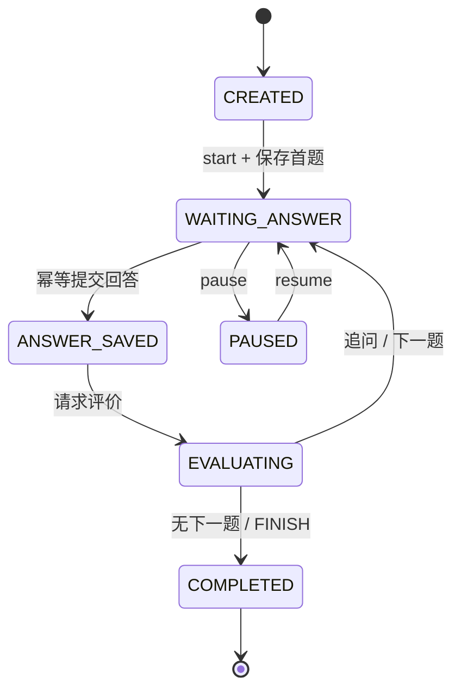

# Interview Copilot Agent

面向 AI 应用开发岗位的本地优先文字模拟面试系统。

当前已完成第一阶段可运行闭环，并启动第二阶段 P0：将两个 Agent 的职责、输入输出与决策审计显式化；将岗位匹配和评分聚合变为可复算、可追溯的后端规则。

## 系统架构（Phase 2）

```text
React / Vite
  │ REST（X-User-ID 本地身份边界）
  ▼
FastAPI API ── 事务边界 / Pydantic 校验 / 统一错误响应
  ├── Resume、JD、Match、Knowledge、Progress、Report Services（确定性服务）
  └── Interview Workflow（持久化状态机）
        ├── InterviewAgent：计划、追问、下一题、结束
        └── EvaluationAgent：维度评分、纠错、改进建议
              │ 受控 JSON 输出 / 最多两次修复重试
              ▼
      OpenAI-compatible ModelGateway（DeepSeek 等）
              │
PostgreSQL + pgvector ◀── 业务数据、向量检索、Agent 决策审计
```

两个 Agent 都不能直接执行 SQL、修改会话状态或访问文件。后端先构造最小化输入，模型只返回 Pydantic Schema 规定的 JSON；状态机、追问上限、题目去重、用户 ACL 和持久化均由普通服务控制。每次计划、评分和下一步决策均写入 `agent_decision_logs`，记录执行模式（`model` / `fallback`）、输入摘要、输出摘要、模型名和 Prompt 版本；审计记录不保存简历原文或回答原文。

## 本地启动

```powershell
conda create --name Agent python=3.13
conda activate Agent
cd backend
pip install -e ".[dev]"
uvicorn app.main:app --reload --port 18000
```

服务启动后访问 `http://127.0.0.1:18000/docs`，健康检查为 `GET /health`。这里使用 18000，避免部分 Windows / Docker 环境中 8000 被系统保留。

## Web 前端

开发模式（需先启动后端）：

```powershell
cd frontend
npm install
npm run dev
```

打开 `http://127.0.0.1:5173`。Vite 默认会将 `/api` 请求代理到本地 `http://127.0.0.1:18000` 的 FastAPI，无需额外配置 CORS。只有后端改用其他地址时，才在启动前设置 `VITE_BACKEND_URL` 覆盖默认值。

完整 Docker Compose 模式：

```powershell
docker compose up --build
```

前端同样位于 `http://127.0.0.1:5173`，Nginx 会将 API 请求反向代理给后端。

## 数据库迁移

先从 `.env.example` 创建项目根目录的 `.env`，并启动 PostgreSQL：

```powershell
Copy-Item .env.example .env
docker compose up -d postgres
conda activate Agent
cd backend
alembic upgrade head
```

本机直接运行 Uvicorn 时，`.env` 中的数据库主机应为 `localhost`；`docker-compose.yml` 会为容器内后端自动覆盖为 `postgres`。

迁移会创建用户资料、面试会话、评分、报告、知识库向量及 Agent 决策审计表。所有简历和 JD 读取接口均通过 `X-User-ID` 请求头进行用户范围过滤；这是本地单用户模式下的临时身份边界，后续会替换为认证模块。

## 当前 API

- `POST /api/v1/users`：创建本地用户；
- `POST /api/v1/resumes/upload`：上传 PDF、DOCX、Markdown 或 TXT 简历并提取正文；
- `POST /api/v1/resumes`、`GET /api/v1/resumes`、`GET /api/v1/resumes/{id}`；
- `POST /api/v1/jobs`、`GET /api/v1/jobs`、`GET /api/v1/jobs/{id}`；
- `POST /api/v1/matches`、`GET /api/v1/matches/{id}`；
- `POST /api/v1/interview-plans`、`GET /api/v1/interview-plans/{id}`；
- `POST /api/v1/interviews`、`GET /api/v1/interviews/{id}`；
- `POST /api/v1/interviews/{id}/start|pause|resume`；
- `GET /api/v1/interviews/{id}/question`；
- `POST /api/v1/interviews/{id}/answers`；
- `POST /api/v1/interviews/{id}/report/regenerate`、`GET /api/v1/interviews/{id}/report`；
- `GET /api/v1/progress/overview|skills|weak-topics|review-plan`；
- `GET /health`。

除创建用户外，以上业务接口都必须包含 `X-User-ID: <用户 UUID>`。

## 模型配置与结构化分析

在项目根目录 `.env` 中配置一个 OpenAI-compatible 服务后，可调用结构化分析接口：

```env
CHAT_BASE_URL=https://your-provider.example/v1
CHAT_API_KEY=your-api-key
CHAT_MODEL=your-model-name
```

- `POST /api/v1/resumes/{resume_id}/analyze`：提取候选人画像、简历风险与项目来源；
- `POST /api/v1/jobs/{job_id}/analyze`：提取岗位职责、必备/加分技能和面试重点。

模型输出均须通过 Pydantic 校验。项目证据会回查简历原文；无法验证的项目结论不会写入数据库。

## 岗位匹配

前端默认提供 AI 应用开发、RAG / LLM 应用工程师、Python 后端开发三个目标岗位模板；选择模板后系统会保存对应的标准岗位要求。需要面向某个具体职位训练时，才使用“自定义岗位 / 粘贴 JD”。当简历与岗位都完成结构化分析后，向 `POST /api/v1/matches` 提交 `resume_id` 和 `job_id`。系统会持久化并返回：

- `readiness_index`：用于训练优先级的指数，不代表录取概率；
- `matching_rule_version`、`weight_config` 与 `score_breakdown`：用于复算匹配过程；
- 必备/加分技能的覆盖状态；
- 必备技能缺口、项目证据不足项与复习主题；
- 推荐准备顺序。

当前规则版本为 `matching_rules/v2`。后端对标准化技能名进行集合匹配，再依据项目证据计算：

```text
readiness_index = 70% × 必备技能覆盖率
                + 20% × 加分技能覆盖率
                + 10% × 项目证据覆盖率
```

每个技能条目都会返回 `score`、`reason` 与 `evidence_refs`。因此“技能已识别但项目证据不足”和“完全缺失”是可区分、可解释的结果，而非 LLM 主观打分。

## 面试计划与会话

向 `POST /api/v1/interview-plans` 提交 `resume_id`、`job_id` 和可选 `config`，Interview Agent 会返回带题目蓝图的个性化计划。随后：

1. 向 `POST /api/v1/interviews` 提交 `plan_id`；
2. 调用 `/start`，再通过 `/question` 读取当前题；
3. 调用 `/answers` 提交回答，必须提供稳定的 `idempotency_key`；
4. 会话可随时 `/pause` 与 `/resume`，状态保留在 PostgreSQL。

当前回答会先保存为 `ANSWER_SAVED`；调用评价接口后，系统会进入追问、下一题或完成状态。完成面试后即可生成整场报告。



## 回答评价与下一题

提交回答后调用 `POST /api/v1/interviews/{session_id}/evaluate`。评分采用三层链路：

1. 后端运行确定性检查：非空、回答长度、预期要点的文本命中率、项目证据是否可用；
2. Evaluation Agent 根据固定维度输出定性评分、错误与遗漏、回答框架、改进回答和练习题；
3. 后端按存档 Rubric 重算总分，拒绝模型自行计算总分。

评分记录会持久化 Rubric、模型调用配置、确定性检查结果、模型名、Prompt 版本与置信度。随后 Interview Agent 会决定追问、进入下一道计划题或结束面试；若模型不可用，则使用既定题目蓝图推进，不丢失已保存的回答与评分。

可通过 `GET /api/v1/answers/{answer_id}/evaluation` 读取已保存评价。

## 整场报告与长期训练

当面试状态为 `COMPLETED` 后，调用 `POST /api/v1/interviews/{session_id}/report/regenerate` 生成报告。报告聚合单题评价，提供总体/维度分数、强弱技能、薄弱主题与下一次训练建议。

首次生成报告时，Progress Service 会使用确定性规则更新每项技能的掌握度与复习时间：低于 60 分次日复习、60—79 分三天后复习、80 分及以上七天后复习；重复生成同一报告不会重复累计训练次数。

## 项目知识库与 RAG

上传项目 README、设计文档、Markdown、TXT 或 PDF 后，系统会解析并标题感知切分文档。调用 `POST /api/v1/knowledge/documents/{document_id}/reindex` 后会生成向量索引；未配置 Embedding 时，文档仍可使用关键词检索。

- `POST /api/v1/knowledge/documents`：`multipart/form-data` 上传文件，`source_type` 为 `project_docs` 或 `knowledge_base`；
- `POST /api/v1/knowledge/search`：Hybrid Search，返回文档名、片段 ID、来源类型和融合分数；
- `DELETE /api/v1/knowledge/documents/{document_id}`：删除原始文件与索引；
- 所有文档、切片和检索均以 `user_id` 为第一层 ACL 过滤，不跨用户返回结果。

## 目录

```text
backend/app/
  agents/      # Interview Agent、Evaluation Agent 与模型调用边界
  api/         # FastAPI 路由
  core/        # 配置和统一错误响应
  prompts/     # 版本化 Prompt
  schemas/     # Pydantic 契约
  services/    # 普通业务服务（后续实现）
  workflows/   # 可恢复面试状态机
backend/tests/ # 单元测试
```

## 验证基线

```powershell
cd backend
python -m ruff check app tests
python -m pytest -q
```

测试覆盖：Schema 与 Rubric 重算、固定回答评测集、岗位匹配的 70/20/10 规则与证据引用、用户 ACL 的知识检索、会话暂停/恢复和幂等回答、模型不可用时的计划/评价降级与会话继续推进。固定回答集的使用方式见 [docs/evaluation_benchmark.md](docs/evaluation_benchmark.md)。

## 数据库演进说明

Alembic 迁移按业务能力演进，而不是以迁移数量作为卖点：`01` 用户/简历/JD，`02` 匹配报告，`03` 面试计划、会话、问题与回答，`04` 单题评价，`05` 报告与掌握度，`06` 知识库与 pgvector，`07` 统一时区时间戳，`08` Agent 决策审计，`09` 评分 Rubric、调用配置和确定性检查。

所有迁移均提供 `upgrade` / `downgrade`。其中 `09` 为历史评价新增可空追溯字段，不会改写或删除既有评价数据；历史记录没有这些元数据时，接口会返回 `null`，新生成的评价才会完整写入。

详细设计见 [agent_design.md](agent_design.md)，产品规格见 [spec.md](spec.md)。
